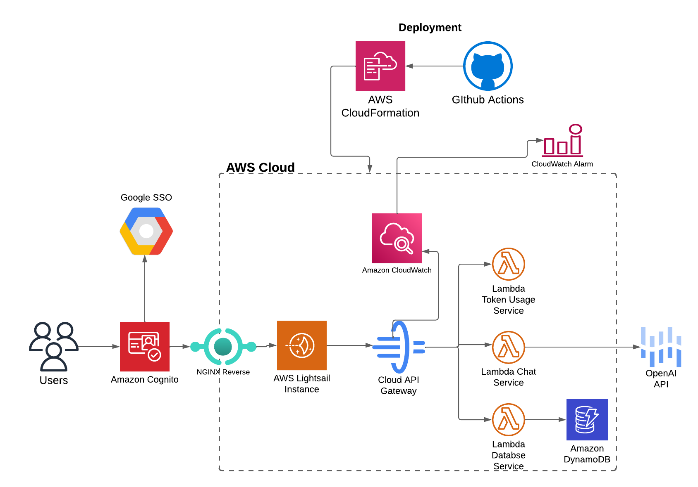

# student-llm-adivsor

Dialogue-Based Student Portal Design using a Large Language Model (LLM)

## Project Overview

The Student LLM Advisor is a dialogue-based student portal designed to assist students with various academic tasks using a Large Language Model (LLM). The main features include student management, token usage tracking, course indexing, chatbot integration, and retrieval-augmented generation (RAG) service.

## Architecture Diagram & Tech Stack

### Architecture Diagram (Exluding RAG & Pinecone)



## AWS infrastructure


### Tech Stack

- **AWS SAM**: Serverless Application Model for deploying serverless applications.
- **API Gateway**: Manages API endpoints and routes requests to Lambda functions.
- **Lambda**: Executes backend services for various functionalities.
- **DynamoDB**: NoSQL database for storing student data, token usage, and course information.
- **Cognito**: Manages user authentication and authorization.
- **Pinecone**: Vector database for course indexing.
- **OpenAI API**: Provides LLM capabilities for chatbot and RAG services.
- **Swagger**: API documentation and testing.
- **FastAPI**: Framework for building APIs with Python.

## Setup & Installation

### Prerequisites

- AWS CLI
- SAM CLI
- Python 3.12
- Node.js (for frontend)

### Step-by-Step Instructions

1. **Clone the repository**:
    ```sh
    git clone https://github.com/your-repo/student-llm-adivsor.git
    cd student-llm-adivsor
    ```

2. **Install dependencies**:
    ```sh
    cd backend
    python -m venv venv
    source venv/bin/activate
    pip install -r requirements.txt
    ```

3. **Add your environment variables**:
    Create a `env.json` file in the `backend` directory with the following content:
    ```env
    PINECONE_API_KEY=<your_pinecone_api_key>
    PINECONE_ENVIRONMENT=<your_pinecone_environment>
    PINECONE_INDEX_NAME=<your_pinecone_index_name>
    PINECONE_HOST=<your_pinecone_host>
    OPENAI_API_KEY=<your_openai_api_key>
    ```

4. **Deploy using AWS SAM**:
    ```sh
    sam build
    sam deploy --guided
    ```

5. **Configure AWS Cognito and API Gateway**:
    - Set up a Cognito User Pool and update the `UserPoolArn` in `template.yml`.
    - Configure API Gateway to use the Cognito authorizer.

## Services & Endpoints (API Documentation)

### All Endpoints

- **GET /student**: Retrieves a student by ID.
- **PUT /student**: Creates or updates a student record.
- **PATCH /student**: Partially updates student information.
- **GET /student/check**: Checks if a student ID exists in the database.
- **POST /token-usage**: Uploads token usage data.
- **GET /token-usage**: Retrieves token usage data.
- **POST /chat**: Sends a message to the chatbot and receives a response.
- **POST /indexing**: Indexes all courses in the Pinecone database.
- **POST /indexing/{course_id}**: Indexes a specific course.
- **DELETE /indexing/{course_id}**: Deletes a course from the index.
- **GET /indexing/health-check**: Checks if the indexing service is running and available.
- **POST /rag**: Processes a query by retrieving relevant context from the index using OpenAI.

### Example Requests and Responses

#### **GET /student**

- **Request**:
    ```sh
    curl -X GET "https://api.example.com/student?id=123456" -H "Authorization: Bearer <token>"
    ```

- **Response**:
    ```json
    {
        "id": "123456",
        "name": "John Doe",
        "advisor": "Dr. Smith"
    }
    ```

#### **POST /chat**

- **Request**:
    ```sh
    curl -X POST "https://api.example.com/chat" -H "Authorization: Bearer <token>" -H "Content-Type: application/json" -d '{
        "message": "What's the assessment for the Devops and Cloud course?",
        "studentID": "123456"
    }'
    ```

- **Response**:
    ```json
    {
        "response": "Hello! How can I assist you today?",
        "usage": {
            "prompt_tokens": 10,
            "completion_tokens": 20,
            "total_tokens": 30
        }
    }
    ```

#### **POST /rag**

- **Request**:
    ```sh
    curl -X POST "https://api.example.com/rag" -H "Authorization: Bearer <token>" -H "Content-Type: application/json" -d '{
        "query": "What are the course details for Master Software Engineering?"
    }'
    ```

- **Response**:
    ```json
    {
        "response": "Here is the detailed course information...",
        "retrieved_contexts": ["context1", "context2"]
    }
    ```

#### **POST /indexing**

- **Request**:
    ```sh
    curl -X POST "https://api.example.com/indexing" -H "Authorization: Bearer <token>"
    ```

- **Response**:
    ```json
    {
        "message": "All courses indexed successfully"
    }
    ```

#### **POST /token-usage**

- **Request**:
    ```sh
    curl -X POST "https://api.example.com/token-usage" -H "Authorization: Bearer <token>" -H "Content-Type: application/json" -d '{
        "student_id": "123456",
        "total_tokens": 100,
        "prompt_tokens": 50,
        "completion_tokens": 50
    }'
    ```

- **Response**:
    ```json
    {
        "message": "Token usage recorded successfully"
    }
    ```

## Usage Examples

### cURL Examples

- **Get Student Information**:
    ```sh
    curl -X GET "https://api.example.com/student?id=123456" -H "Authorization: Bearer <token>"
    ```

- **Create or Update Student**:
    ```sh
    curl -X PUT "https://api.example.com/student" -H "Authorization: Bearer <token>" -H "Content-Type: application/json" -d '{
        "id": "123456",
        "name": "John Doe",
        "advisor": "Dr. Smith"
    }'
    ```

### Python Script Example

```python
import requests

def get_student_info(api_url, token, student_id):
    headers = {
        "Authorization": f"Bearer {token}",
        "Content-Type": "application/json"
    }
    response = requests.get(f"{api_url}/student", headers=headers, params={"id": student_id})
    return response.json()

api_url = "https://api.example.com"
token = "<your_token>"
student_id = "123456"

student_info = get_student_info(api_url, token, student_id)
print(student_info)
```

## Development & Contribution Guide

### Folder Structure

- backend: Contains all backend services and handlers.
- llm_advisor_app: Contains the frontend application.
- documentation: Contains project documentation and diagrams.

### Adding New API Endpoints

1. **Create a new service in `backend/services/`**.
2. **Add a new handler in `backend/handlers/`**.
3. **Update `template.yml` to include the new Lambda function and API Gateway configuration**.
4. **Update `swagger.yaml` to document the new endpoint**.

### Testing Locally

1. **Start the backend**:
    ```sh
    cd backend
    ./start_local.sh
    ```

2. **Start the frontend**:
    ```sh
    cd llm_advisor_app/
    npm run dev
    ```

3. **Run tests**:
    ```sh
    pytest tests/
    ```

## Deployment & Monitoring

### Deploy to AWS

```sh
sam build
sam deploy --guided
```

### Monitoring & Logging

- **CloudWatch**: Monitor Lambda function logs and API Gateway logs.
- **API Gateway Logs**: Enable logging in API Gateway settings.

### GitHub Actions Pipeline

This project uses GitHub Actions for continuous integration and deployment. The pipeline is defined in `.github/workflows/main.yml` and includes the following jobs:

- **test-backend**: Runs unit tests for the backend services.
- **build-backend**: Builds the backend services.
- **build-and-deploy-frontend**: Builds and deploys the frontend application.
- **deploy-backend**: Deploys the backend services to AWS.

The pipeline is triggered on every push to the `main` branch.

### Automatic Deployment

The deployment process is automated using AWS SAM and GitHub Actions. When changes are pushed to the `main` branch, the pipeline automatically builds and deploys the backend and frontend services to AWS.

## Database Structure

The project uses a single-table design in DynamoDB to store all entities related to the Student Management Portal. The table is optimized for common access patterns while ensuring data isolation between students.

### Primary Table Structure

- **Partition Key (PK)**: Entity type prefix followed by ID (e.g., `USER#123`)
- **Sort Key (SK)**: Hierarchical identifier for item types (e.g., `PROFILE`)

### Example Entities

- **Student (User)**
    - PK: `USER#{userId}`
    - SK: `PROFILE`
    - Attributes: `userId`, `email`, `name`, `createdAt`, `lastLogin`

- **Class**
    - PK: `CLASS#{classId}`
    - SK: `INFO`
    - Attributes: `classId`, `title`, `instructor`, `description`

- **Enrollment**
    - PK: `USER#{userId}`
    - SK: `CLASS#{classId}`
    - Attributes: `userId`, `classId`, `enrollmentDate`, `status`

- **Grade**
    - PK: `USER#{userId}`
    - SK: `GRADE#{itemId}`
    - Attributes: `userId`, `itemId`, `classId`, `score`

- **Usage Tracking**
    - PK: `USER#{userId}`
    - SK: `USAGE#{timestamp}`
    - Attributes: `userId`, `timestamp`, `inputTokens`, `outputTokens`

## Troubleshooting & FAQ

### Common Issues

- **Missing Environment Variables**: Ensure all required environment variables are set in `.env`.
- **Cognito Authentication Errors**: Verify the Cognito User Pool configuration and tokens.

### Example Errors

- **Invalid JSON in Request Body**:
    ```json
    {
        "error": "Invalid JSON in request body"
    }
    ```

## License & Acknowledgments

### License

This project is licensed under the MIT License.
