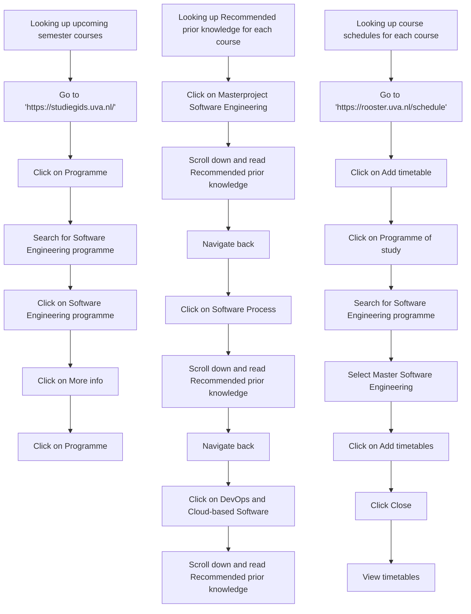

# Flowchart for an example user story using [Mermaid](https://david-mohr.com/blog/mermaid-create-diagrams-in-markdown)

**Note: the PNG was generated using [draw.io](https://app.diagrams.net)**

`Click Arrange > Insert > Advanced > Mermaid`

#### GitHub
Github renders every Mermaid code-block inside of Markdown files, issues, and PR comments automatically into an iframe, which works fantastic plus you have version control.

#### VS-Code
If you are using VS Code like me, I recommend installing the [Mermaid Markdown plugin](https://marketplace.visualstudio.com/items?itemName=bierner.markdown-mermaid). That way Mermaid code-blocks will be rendered in the preview window.

## Userstory: 
As a student I want to know the course schedule and recommended prior 
knowledge of a specific course so that I can better oriënt myself for the 
upcomming semester. 
(Assuming the student follows MSC Software Engineering and is at the end of the first sem.)

## Flow:
1. Looking up what courses I have in the upcomming semester
   1. Go to https://studiegids.uva.nl/
   2. Click on "Programme"
   3. Search for the "Software Engineering" programme
   4. Click on the "Software Engineering programme
   5. Click on "More info"
   6. Click on "Programme"
2. Looking up the Recommended prior knowledge for each course
   1. Click on "Masterproject Software Engineering"
   2. Scroll down and read the Recommended prior knowledge
   3. Navigate a page backwards
   4. Click on "Software Process"
   5. Scroll down and read the Recommended prior knowledge
   6. Navigate a page backwards
   7. Click on "DevOps and Cloud-based Software"
   8. Scroll down and read the Recommended prior knowledge
3. Looking up the course schedules for each course 
   (Assuming that they all fall under the same programme of study)
   1. Go to "https://rooster.uva.nl/schedule"
   2. Click on "Add timetable"
   3. Click on "Programme of study"
   4. Search for the "Software Engineering" programme
   5. Select "Master Software Engineering"
   6. Click on "Add timetables"
   7. Click "Close"
   8. View the timetables

## Chart:
